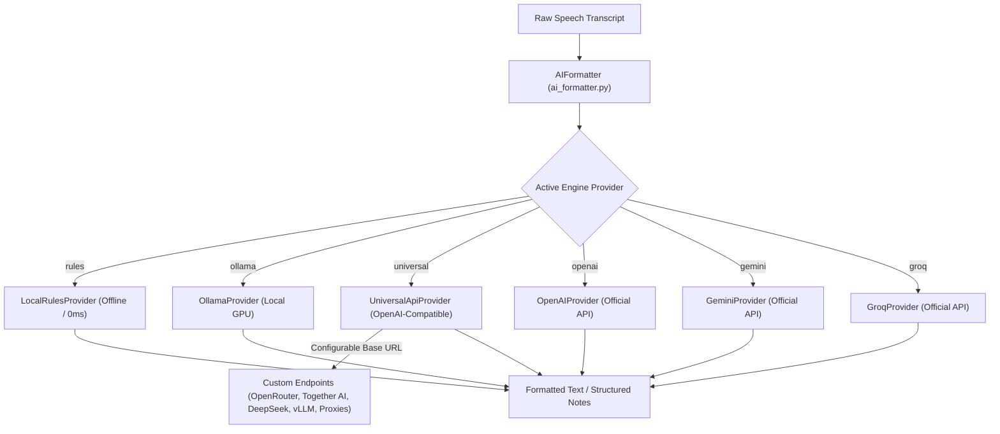

# Project Context: Velodictum Desktop

## 1. Mission & Overview
Velodictum is a high-performance, local-first AI dictation and voice-editing assistant for Windows 11. It transforms spoken voice into clean, professionally formatted, context-aware written text in real time and automatically injects it into any active desktop application.

---

## 2. Design System & UX Principles
* **Strict Zero-Emoji Policy**: No emojis in UI labels, buttons, tables, system tray menus, status badges, or code artifacts. Clean text and monochrome SVG iconography only.
* **Liquid Glass Design System (Standard)**: Hardware-accelerated Windows 11 Acrylic backdrop (`apply_window_backdrop` with `DWMWA_SYSTEMBACKDROP_TYPE = 3`), translucent obsidian surfaces (`rgba(14, 14, 18, 0.72)`), and top specular light highlights (`rgba(255, 255, 255, 0.12)`).
* **Quiet Typography & Non-Clipping Layouts**: Unclipped custom preset cards, dynamic surface blends, and clear informational hierarchy.
* **Focus-Aware Visual Feedback**: Recording and processing indicators only react when the respective interface or global capture is in active focus.

---

## 3. Two-Tier Dictation & Style Architecture

VeloFlow separates text generation into two distinct, non-overlapping architectural layers:

### Tier 1: Betriebsmodus (Operating Mode)
* **Intelligenter Flow (`flow`)**: Full AI post-processing pipeline. Removes disfluencies, fixes self-corrections, structures lists, executes spoken punctuation directives, and optimizes sentence structure.
* **Rohdiktat (`raw`)**: 1:1 Acoustic Whisper bypass. Output is delivered directly from the speech recognition model without any LLM transformation or alteration.

### Tier 2: Tonalitäts- & Stilprofile (Tone & Style)
Applied exclusively when Operating Mode is set to **Intelligenter Flow**:
1. **Standard (`default`)**: Balanced, clear, professional tone suitable for daily work.
2. **Formell (`formal_sie`)**: Formal German communication using "Sie"-form.
3. **Locker (`informal_du`)**: Relaxed, conversational communication using "Du"-form.
4. **Prägnant & Direkt (`concise`)**: Short, bullet-ready, to-the-point formulation.
5. **Akademisch & Gehoben (`academic`)**: High-register vocabulary, elaborate sentence structure, and precise technical phrasing.

---

## 4. Provider-Agnostic AI Formatting Architecture & Universal API

The semantic post-processing engine is built around a decoupled, provider-agnostic strategy (`formatting_providers.py`):

### Universal API Features
* **Configurable Base URL (`api_endpoint`)**: Connects to any OpenAI-compatible `/chat/completions` and `/models` endpoint (OpenRouter, Together AI, DeepSeek, Fireworks AI, vLLM, LiteLLM, enterprise proxies).
* **Automatic Provider Detection (`detect_provider`)**: Identifies the underlying provider as secondary metadata badge without locking the UI.
* **3-Tier Priority Selector (`MODEL_TIERS`)**: 1-click presets for **Schnelligkeit (< 200 ms)**, **Ausgewogen (~ 400 ms)**, and **Höchste Qualität (2 - 5 s)** with collapsible token pricing and latency inspector.
* **Provider Routing Strategies (`routing_strategy`)**: Native routing injection for OpenRouter endpoints (`sort: "latency"`, `sort: "price"`, `sort: "throughput"`, `sort: "default"`).
* **Zero Data Retention (ZDR) & Privacy Guard**: Guarantees zero data logging on cloud providers with `data_collection: "deny"` and `zdr: true`, plus automated fallback failover.
* **Dynamic Model Catalog & Categorization (`categorize_models`)**: Live query of `/models` with automatic grouping into *Empfohlen*, *Preis-Leistung*, *Schnell & Günstig*, *Höchste Qualität*, and *Weitere Modelle*.
* **Live Connection Diagnostics (`test_connection`)**: Instant verification of endpoint reachability, authentication keys, and model response times.
* **Backward Compatibility**: Transparent migration of legacy configuration keys (`engine: openrouter` -> `universal`).

---

## 5. End-to-End Core Pipeline Layers

### Layer 1: Audio Capture & Studio Sound Cues (`audio_recorder.py`, `sound_effects.py`)
* Low-latency stream using `sounddevice` (PortAudio), 16 kHz Mono Float32 standard format.
* Dynamic RMS volume meter callbacks for live UI 36-bar visualizer animations.
* Studio-grade synthesized harmonic audio chimes (`sound_effects.py`) with soft cosine fade envelopes on start/stop recording.

### Layer 2: Speech-to-Text Engine (`stt_engine.py`, `cloud_stt.py`)
* **3 Unified Transcription Providers**:
  1. **Lokal**: `faster-whisper` (CTranslate2 backend on CUDA FP16 or CPU Int8).
  2. **Grok AI**: Ultra-fast Whisper-Large-v3 via Groq Cloud LPU (`<80ms`).
  3. **OpenAI**: Cloud Whisper-1 via official OpenAI Audio API.
* **Acoustic Prompt Conditioning**: Injects user dictionary entries (`custom_vocabulary.py` / `vocabulary.json`) directly into the decoder prompt.
* **Hallucination Squelcher**: Rejects low-entropy repetitive loops and silence hallucinations based on Shannon entropy analysis and blacklisted hallucination patterns.

### Layer 3: Context Intelligence (`window_context.py`)
* Win32 foreground window and caret analysis (`GetForegroundWindow`, `GetWindowTextW`, process metadata).
* Context categorization: **IDE / Code** (VS Code, PyCharm, Cursor), **Email** (Outlook, Thunderbird), **Chat** (Slack, Discord, Teams), **Notes / Docs** (Notion, Obsidian, Word).
* UI Automation caret inspection for automatic capitalization and punctuation continuity.

### Layer 4: Semantic Flow Layer & Note Structuring (`ai_formatter.py`)
* Single-pass semantic cleanup, disfluency removal, spoken punctuation interpretation, and tone transformation.
* **XML Anti-Answering Protection**: Encloses verbatim speech in `<diktat>...</diktat>` tags to prevent LLMs from answering dictations that contain questions or coding instructions.
* **Note Structuring (`structure_notes`)**: Transforms unstructured brain dumps and raw meeting notes into structured Markdown documents (headings, bullet points, task checkboxes).

### Layer 5: Smart Text Injection & Voice Actions (`text_injector.py`, `voice_editor.py`)
* Clipboard backup, atomic paste injection via Win32 keystroke emulation, and delayed asynchronous clipboard restoration.
* **Send It Voice Action**: Automatic detection of spoken sending triggers (*"und absenden"*, *"und abschicken"*, *"send it"*). Strips the trigger phrase and simulates an Enter keypress in messaging apps.
* **In-Place Voice Editor ("Velodictum Transform")**: Global shortcut `CTRL + ALT + SPACE` / `CTRL + ALT + Z` for transforming highlighted text in any application based on voice instructions.

### Layer 6: Mobile LAN Bridge (`mobile_bridge_server.py`)
* Zero-config HTTP/WebM server running on local LAN.
* Allows dictating into desktop applications via smartphone browser microphone.
* QR code pairing and live IP detection (`get_local_ip()`).

### Layer 7: User Interface & Windows (`gui/`)
* **Studio Dashboard (`gui/dashboard_window.py`)**: Hardware telemetry (GPU VRAM, CUDA capability), live audio visualizer, 2-tier mode/tone selectors, and dynamic provider settings.
* **Floating HUD Pill (`gui/floating_hud.py`)**: Ultra-smooth physics-based spring morphing, rubber overshoot popping, squash & stretch volume preservation, and specular glass highlights with zero idle CPU overhead.
* **Collapsible Accordion Settings Architecture (`CollapsibleSettingsCard`)**: 7 collapsible cards with live status summary badges and global `[ Alle aufklappen ]` / `[ Alle einklappen ]` actions to prevent information overload.
* **Velodictum Scratchpad (`gui/scratchpad_window.py`)**: Standalone, focus-aware note-taking notepad with direct 1-click dictation toggle and AI structuring.
* **System Tray Daemon (`gui/tray_icon.py`)**: Background status, quick mode toggling, and instant profile switching.

---

## 6. Global Hotkeys & Shortcuts

| Shortcut | Action | Description |
| :--- | :--- | :--- |
| `CTRL + ALT + SPACE` | Push-to-Talk / Toggle Dictation | Primary dictation trigger for injecting text into the active window |
| `CTRL + SHIFT + D` | Scratchpad Toggle | Opens/focuses the WhisperFlow Scratchpad window |
| `CTRL + ALT + Z` | In-Place Voice Editor | Rewrites highlighted/selected text in any app via voice instruction |

---

## 7. Verification & Automated Test Suites

All features are covered by the comprehensive end-to-end test suite in `test_power_features_e2e.py`:
* **Test 1**: Hotkey Decoding (Windows ASCII control code normalization for Ctrl combinations)
* **Test 2**: 'Send It' Voice Trigger Regex & Execution
* **Test 3**: Hallucination Squelcher & Silence Filtering
* **Test 4**: Context Intelligence & Foreground Window Detection
* **Test 5**: Mobile LAN Bridge HTTP/WebM Lifecycle & Dictation API
* **Test 6**: Config Dataclasses & Field Persistence
* **Test 7**: 2-Tier Architecture (Operating Mode & Tone Profiles)
* **Test 8**: Scratchpad Mic Button & Note Structuring
* **Test 9**: Universal API, Provider Detection, Model Categorization, & Dynamic UI Switching
