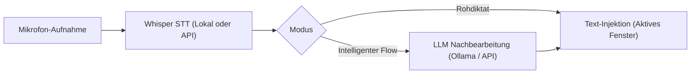

# Velodictum

> **Lokale KI-Spracheingabe und Text-Transformation für Windows**  
> Ein schlankes, Open-Source-Tool für systemweites Diktieren mit lokaler Spracherkennung (Whisper) und optionaler KI-Nachbearbeitung (Ollama / Cloud-APIs).

[](https://microsoft.com/windows)
[](https://python.org)
[](https://github.com/SYSTRAN/faster-whisper)
[](LICENSE)

---

## Funktionsweise

Velodictum nimmt Sprache über ein globales Tastenkürzel auf, wandelt sie per Whisper in Text um und fügt das Ergebnis automatisch in das gerade aktive Programm (z. B. VS Code, Browser, Word, Slack, Outlook) ein.



### Hauptfunktionen

* **Zwei Diktier-Modi**:
  * **Rohdiktat**: 1:1 Transkription direkt aus Whisper ohne Veränderung.
  * **Intelligenter Flow**: Bereinigt Füllwörter (*"äh"*, *"ähm"*), korrigiert Versprecher (*"drei, ach nein, vier"*), formatiert Aufzählungen automatisch als Markdown-Listen und wendet optionale Tonalitätsprofile an (Formell, Locker, Prägnant, Akademisch).
* **Flexible Spracherkennung (STT)**:
  * **Lokal**: `faster-whisper` (CTranslate2) auf NVIDIA CUDA oder CPU.
  * **Cloud / API**: Groq (Whisper-Large-v3, <100ms) oder offizielle OpenAI Whisper API.
* **Flexible KI-Nachbearbeitung**:
  * **100% Offline**: Lokale Modelle über Ollama (z. B. `qwen2.5:7b` oder `llama3.3`).
  * **Universal API**: Jeder OpenAI-kompatible Endpoint (OpenRouter, DeepSeek, Together AI, Google Gemini, vLLM).
* **Text-Transformation per Sprache ("Voice Editor")**:
  * Text in beliebiger App markieren, `Ctrl + Alt + Space` drücken, Anweisung einsprechen (z. B. *"Formuliere das höflicher"* oder *"Übersetze auf Englisch"*). Der markierte Text wird direkt ersetzt.
* **Status-Overlay & Audio-Feedback**:
  * Unaufdringliches Floating-HUD mit Pegelanzeige während der Aufnahme.
  * Kurze, prozedural generierte Audio-Cues beim Start/Stopp (keine externen Sounddateien nötig).
* **Fachwörterbuch**:
  * Eigene Fachbegriffe, Namen und Abkürzungen hinterlegen, die automatisch in den Whisper-Prompt eingespeist werden.
* **Audio-Helfer**:
  * **Auto-Ducking**: Senkt Hintergrund-Audio (Musik/Videos) während der Aufnahme automatisch ab.
  * **Sofort-Abbruch**: Aufnahme jederzeit per `Escape` verwerfen.
* **Diktier-Notizbuch (Scratchpad)**:
  * Standalone-Notizfenster (`Ctrl + Shift + D`) für längere Diktate mit 1-Klick-Strukturierung.

---

## Tastenkürzel

| Shortcut | Aktion | Beschreibung |
| :--- | :--- | :--- |
| `Ctrl + Alt + Space` *(oder `F8`)* | Diktat starten / stoppen | Nimmt Sprache auf und fügt formatierten Text in die aktive App ein |
| `Ctrl + Shift + D` | Scratchpad | Öffnet das integrierte Diktier- und Notizfenster |
| `Ctrl + Alt + Z` | In-Place Editor | Transformiert markierten Text anhand gesprochener Anweisungen |
| `Escape` | Abbrechen | Verwirft die aktuelle Aufnahme sofort |

---

## Installation & Start

### Voraussetzungen
* **Windows 10 / 11 (64-bit)**
* **Python 3.10 bis 3.13**
* *(Optional)* NVIDIA GPU mit CUDA-Unterstützung (ab 4–6 GB VRAM empfohlen; CPU-Modus funktioniert ebenfalls).

### 1. Repository klonen
```powershell
git clone https://github.com/4bearyy/Velodictum.git
cd Velodictum
```

### 2. Virtuelle Umgebung einrichten & Abhängigkeiten installieren
```powershell
python -m venv .venv
.venv\Scripts\Activate.ps1
pip install -r requirements.txt
```

*(Optional für GPU-Beschleunigung mit CUDA):*
```powershell
pip install torch torchvision --index-url https://download.pytorch.org/whl/cu121
```

### 3. Anwendung starten
Du kannst die Anwendung auf zwei Arten starten:

* **Per Batch-Datei**: Doppelklick auf [`run.bat`](run.bat)
* **Per Befehlszeile**:
  ```powershell
  python main.py
  ```

---

## Standalone-Executable erstellen (.exe)

Wenn du Velodictum als portable `.exe` ohne Python-Abhängigkeit verteilen möchtest, hast du zwei Optionen:

### Option A: Über die Batch-Datei (empfohlen)
Doppelklick auf [`build.bat`](build.bat) – das Skript prüft die Umgebung, installiert bei Bedarf PyInstaller und kann auf Wunsch direkt ein fertiges ZIP-Archiv in `dist/` erstellen.

### Option B: Über Python direkt
```powershell
pip install -r requirements-dev.txt
python build_executable.py
```
Die fertige Anwendung liegt anschließend im Ordner `dist/Velodictum/`.

---

## Projektstruktur

```text
Velodictum/
├── .ai/                 # Systemkontext & Architekturentscheidungen
├── core/                # Anwendungs- & Audio-Engine (Whisper, LLM, Config)
├── gui/                 # Dashboard, Mini-HUD & Themes (PyQt6)
├── tests/               # Unit- & End-to-End Test-Suiten
├── rthooks/             # PyInstaller Runtime-Hooks
├── build.bat / run.bat  # 1-Klick Windows Starter- & Build-Skripte
├── build_executable.py  # PyInstaller Builder
├── main.py              # Einstiegspunkt
├── requirements.txt     # Python Abhängigkeiten
└── README.md            # Dokumentation
```

---

## Datenschutz & Sicherheit


* **Offline-Standard**: Bei lokaler STT und lokaler Ollama-Nutzung verlassen Audiodaten und Texte zu keinem Zeitpunkt deinen Rechner.
* **Sichere Key-Verwaltung**: Cloud-API-Schlüssel werden über den Windows Credential Vault verschlüsselt hinterlegt und in der Oberfläche nur maskiert dargestellt.

---

## Lizenz

Dieses Projekt ist unter der [MIT License](LICENSE) lizenziert.  
Copyright (c) 2026 4bearyy.


