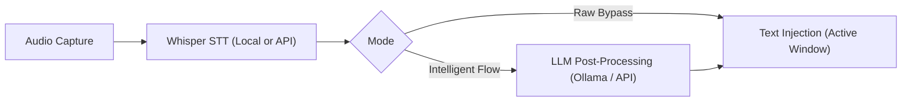

# Velodictum

> **Local-first AI Voice Dictation and In-Place Text Transformation for Windows**  
> A lightweight, open-source desktop tool for system-wide dictation powered by local or cloud speech-to-text models and optional semantic LLM post-processing (Ollama / Cloud APIs).

[](https://microsoft.com/windows)
[](https://python.org)
[](https://github.com/SYSTRAN/faster-whisper)
[](LICENSE)

> [!NOTE]
> **Project Background & AI Disclaimer:**  
> This project was developed primarily through agentic pair programming with an AI coding agent (Google Gemini). It originally served as a practical exploration project to experiment with autonomous coding agents and modern desktop workflows. Because the resulting application proved genuinely useful and interesting for my daily workflow, it is being shared openly on GitHub.

---


## How It Works

Velodictum records your voice via a global shortcut, transcribes it using Whisper, optionally enhances the transcript using an LLM, and automatically injects the formatted text into whatever application is currently focused (e.g. VS Code, browser, Word, Slack, Outlook).



### Core Features

* **Two Operating Modes**:
  * **Raw Bypass (`raw`)**: 1:1 acoustic transcription directly from Whisper without alterations.
  * **Intelligent Flow (`flow`)**: Removes filler words (*"um"*, *"uh"*), fixes spoken self-corrections (*"three, wait no, four"*), formats lists as clean Markdown bullet points, and applies optional tone profiles (Formal, Casual, Concise, Academic).
* **Flexible Speech-to-Text (STT)**:
  * **Local**: `faster-whisper` (CTranslate2) accelerated on NVIDIA CUDA or CPU.
  * **Cloud / API**: Groq (Whisper-Large-v3, <100ms) or official OpenAI Whisper API.
* **Flexible LLM Post-Processing**:
  * **100% Offline**: Local models via Ollama (e.g., `qwen2.5:7b` or `llama3.3`).
  * **Universal API**: Any OpenAI-compatible endpoint (OpenRouter, DeepSeek, Together AI, Google Gemini, vLLM).
* **Voice-Powered Text Transformation ("Voice Editor")**:
  * Highlight text in any application, press `Ctrl + Alt + Space`, and speak your instruction (e.g. *"Make this sound more polite"* or *"Translate to English"*). The selected text is replaced in-place.
* **Status Overlay & Audio Feedback**:
  * Non-intrusive floating HUD with real-time audio visualizer during recording.
  * Short, procedurally synthesized audio cues on start/stop (zero external audio file dependencies).
* **Custom Vocabulary**:
  * Add technical acronyms, personal names, and domain-specific terms that are automatically injected into Whisper's decoding prompt.
* **Audio Power Tools**:
  * **Auto-Ducking**: Automatically attenuates background audio (music, videos) during dictation.
  * **Instant Cancellation**: Press `Escape` at any time to discard the active recording.
* **Dictation Scratchpad**:
  * Standalone notepad window (`Ctrl + Shift + D`) for longer brain dumps with 1-click AI note structuring.

---

## Global Hotkeys

| Shortcut | Action | Description |
| :--- | :--- | :--- |
| `Ctrl + Alt + Space` *(or `F8`)* | Start / Stop Dictation | Captures speech and pastes formatted text into the active window |
| `Ctrl + Shift + D` | Scratchpad | Opens the standalone dictation & note-taking scratchpad |
| `Ctrl + Alt + Z` | In-Place Voice Editor | Transforms highlighted text based on spoken instructions |
| `Escape` | Cancel Recording | Immediately discards the ongoing recording |

---

## Installation & Getting Started

### Prerequisites
* **Windows 10 / 11 (64-bit)**
* **Python 3.10 to 3.13**
* *(Optional)* NVIDIA GPU with CUDA support (4–6 GB VRAM recommended; CPU mode works out of the box).

### 1. Clone the Repository
```powershell
git clone https://github.com/4bearyy/Velodictum.git
cd Velodictum
```

### 2. Set Up Virtual Environment & Dependencies
```powershell
python -m venv .venv
.venv\Scripts\Activate.ps1
pip install -r requirements.txt
```

*(Optional: For GPU acceleration with CUDA):*
```powershell
pip install torch torchvision --index-url https://download.pytorch.org/whl/cu121
```

### 3. Run the Application
You can start Velodictum in two ways:

* **Via Batch Script**: Double-click [`run.bat`](run.bat)
* **Via Command Line**:
  ```powershell
  python main.py
  ```

---

## Building a Standalone Executable (.exe)

To package Velodictum into a portable `.exe` without requiring Python on target machines:

### Option A: Using the Batch Script (Recommended)
Double-click [`build.bat`](build.bat) – it verifies the environment, installs PyInstaller if needed, and can optionally create a release-ready ZIP in `dist/`.

### Option B: Using Python Directly
```powershell
pip install -r requirements-dev.txt
python build_executable.py
```
The resulting executable will be in the `dist/Velodictum/` directory.

---

## Project Structure

```text
Velodictum/
├── .ai/                 # System context & architecture decision records (ADRs)
├── core/                # Core processing engine (Whisper STT, LLM, audio, config)
├── gui/                 # Dashboard, Mini-HUD & theme widgets (PyQt6)
├── tests/               # Unit & end-to-end test suites
├── rthooks/             # PyInstaller runtime security hooks
├── build.bat / run.bat  # 1-click Windows starter and build scripts
├── build_executable.py  # PyInstaller standalone builder
├── main.py              # Application entry point
├── requirements.txt     # Runtime dependencies
└── README.md            # Documentation
```

---

## Privacy & Security

* **Offline-First**: In local STT and local Ollama mode, audio data and text never leave your machine.
* **Secure Key Storage**: Cloud API keys are securely stored in the Windows Credential Vault using DPAPI encryption and masked in the UI.

---

## License

This project is licensed under the [MIT License](LICENSE).  
Copyright (c) 2026 Lion Richter.


